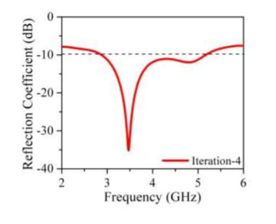
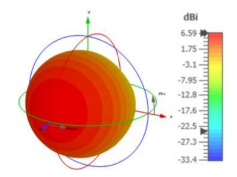
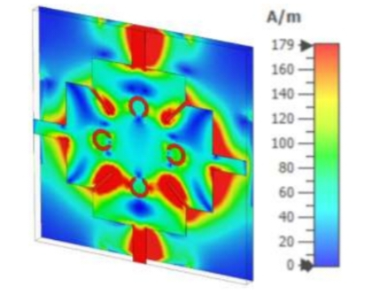
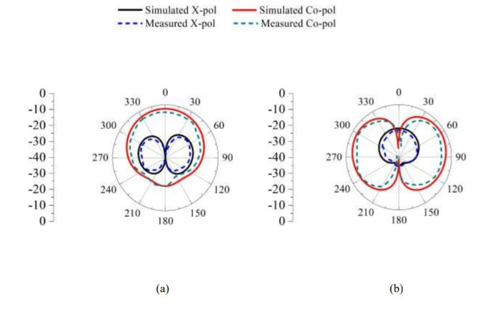
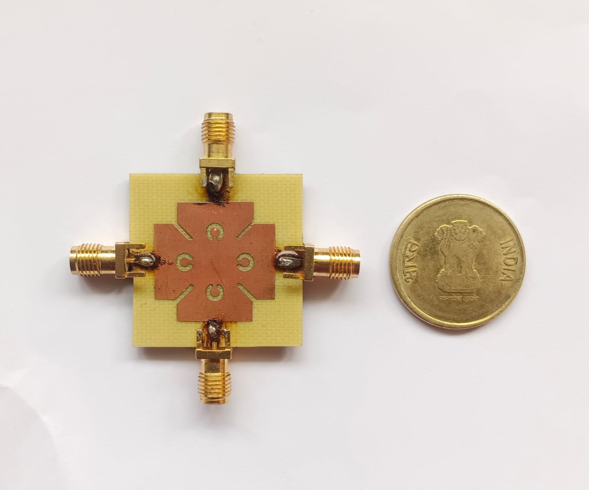
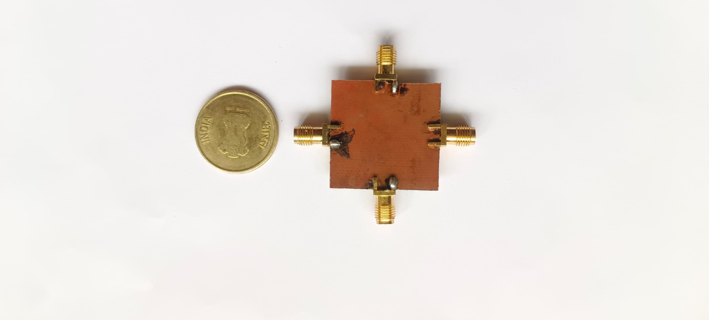
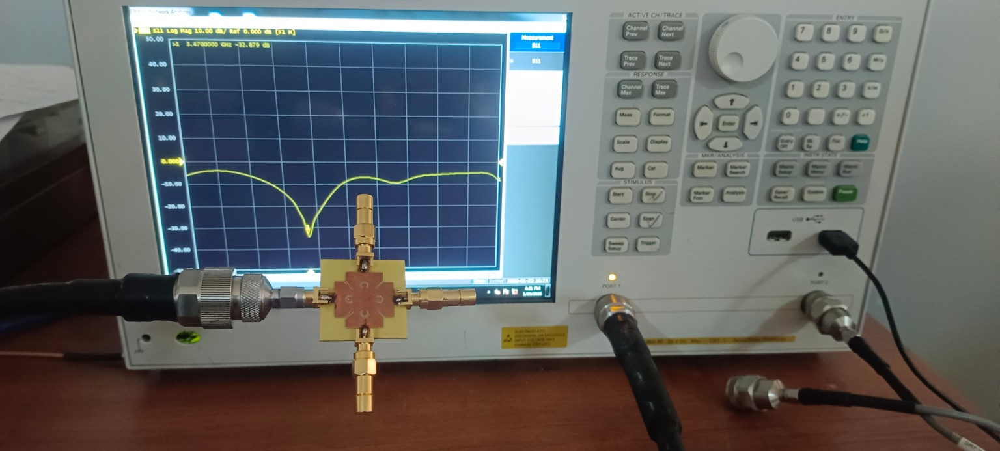
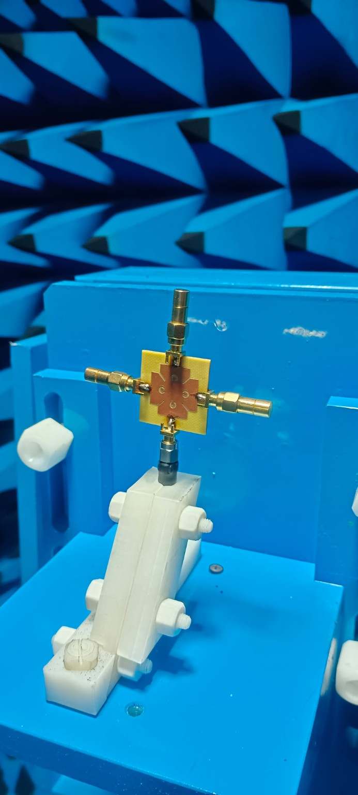

# 📡 CSRR-Loaded Quad-Port Common Patch Antenna for 5G NR Applications

## 👨‍💻 Project Overview

This project focuses on the design and simulation of a CSRR-loaded
quad-port common patch antenna configuration for 5G NR applications.

The antenna was designed and analyzed using CST Microwave Studio as
part of my B.Tech Electronics and Communication Engineering project.

## 🎯 Objective

The objective of this project is to design and analyze a multi-port
antenna configuration suitable for 5G NR wireless communication
applications.

## 🛠️ Tools & Technologies

- CST Microwave Studio
- Antenna Design
- RF & Microwave Engineering
- 5G NR
- MIMO Technology
- CSRR (Complementary Split Ring Resonator)

## 📊 Analysis

The proposed CSRR-loaded quad-port antenna was designed and simulated
using CST Microwave Studio. The performance of the antenna was evaluated
using various RF and antenna parameters.

The following characteristics were analyzed:

- **S-Parameters:** Used to evaluate the reflection and transmission
  characteristics of the four-port antenna.

- **Return Loss:** Analyzed to determine the impedance matching and
  operating frequency regions of the antenna.

- **Port Isolation:** Evaluated to determine the mutual coupling between
  the antenna ports, which is important for MIMO performance.

- **VSWR:** Studied to evaluate the impedance matching between the antenna
  and the feeding system.

- **Radiation Pattern:** Analyzed to understand the radiation behavior
  and directional characteristics of the antenna.

- **Gain:** Evaluated to determine the antenna's radiation performance
  in the desired operating bands.

- **Efficiency:** Analyzed to determine how effectively the antenna
  converts input power into radiated electromagnetic energy.

The simulation results demonstrate the performance of the proposed
antenna configuration for its intended 5G NR application.

## 📊 Final Simulation and Measurement Results

The final quad-port common patch antenna was analyzed at the target 3.5 GHz operating frequency. The following results present the reflection coefficient, antenna gain, surface current distribution, and radiation characteristics.

### 📉 Reflection Coefficient (S11)

The final antenna configuration resonates around 3.5 GHz with a reflection coefficient of approximately -35 dB, demonstrating good impedance matching at the target operating frequency.

  

<b>Reflection Coefficient (S11) of the Final QCPC Antenna</b>

### 📡 Antenna Gain

The simulated 3D gain pattern at 3.5 GHz shows a maximum gain of approximately 6.59 dBi.

  

<b>3D Gain Pattern of the QCPC Antenna at 3.5 GHz</b>

### ⚡ Surface Current Distribution

The surface current distribution at 3.5 GHz illustrates the current concentration across the common patch, feed regions, rectangular slots, and CSRR-loaded structure. The maximum surface current is approximately 179 A/m.

  

<b>Surface Current Distribution at 3.5 GHz</b>

### 📶 Radiation Patterns

The radiation characteristics were evaluated at 3.5 GHz using co-polarization and cross-polarization patterns. The plots provide a comparison between simulated and measured radiation characteristics.

  

<b>Simulated and Measured Radiation Patterns at 3.5 GHz</b>

---

## Fabricated Antenna and Measurement Setup

The proposed quad-port CSRR-loaded antenna was fabricated and experimentally tested. The following photographs show the fabricated prototype and measurement arrangements.

| Fabricated Antenna – Front View | Fabricated Antenna – Back View |
|---|---|
|  |  |

| VNA Measurement Setup | Anechoic-Chamber Measurement Setup |
|---|---|
|  |  |

## 📄 IEEE Publication

This research work has been published on IEEE Xplore.

**Title:** Design of a CSRR-Loaded Quad-Port Common Patch
Configuration Antenna for 5G NR Applications

🔗 [View Publication on IEEE Xplore](https://ieeexplore.ieee.org/document/11663631)

## 🎓 Academic Information

**Degree:** B.Tech – Electronics and Communication Engineering  
**Institution:** Vignan's Lara Institute of Technology and Science  
**Project Type:** Final Year Major Project

## 👤 Author

**Kasukurthi Vishnu Vardhan**

Electronics and Communication Engineering

## 🚀 Areas of Interest

- VLSI Design
- Embedded Systems
- RF & Microwave Engineering
- FPGA
- Digital Electronics
- 5G Communication

---

⭐ This repository documents my academic research and engineering work
in antenna design and 5G NR communication.
---

## 📘 Detailed Project Documentation

For complete technical details covering the antenna configuration, design methodology, CST simulation, fabrication, VNA measurement, anechoic chamber testing, and performance analysis, see:

### 👉 [View Complete Project Details](PROJECT_DETAILS.md) 
