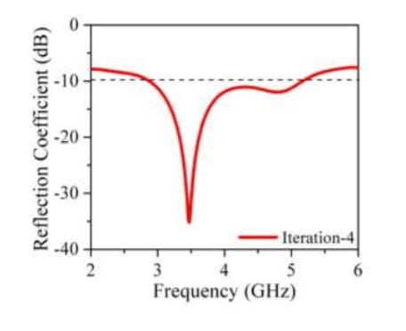
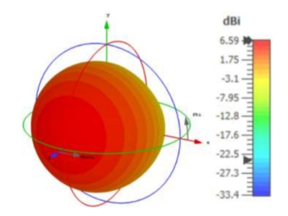
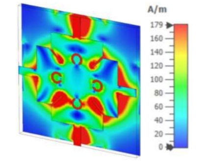
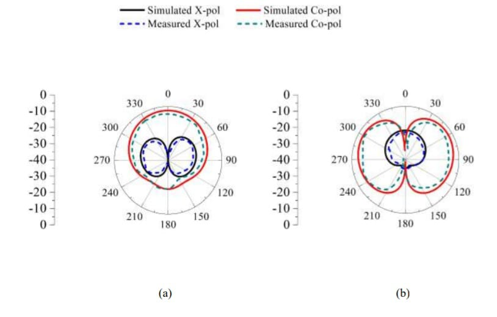
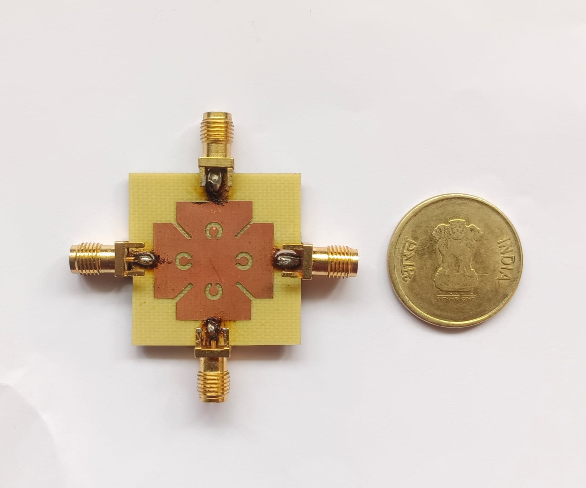
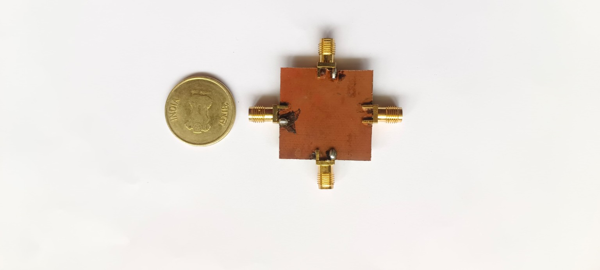
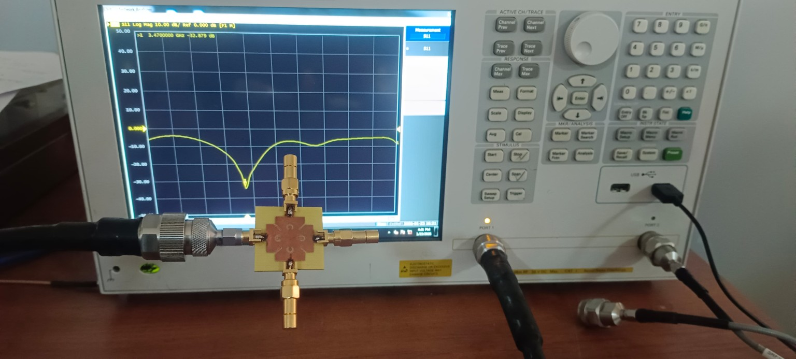
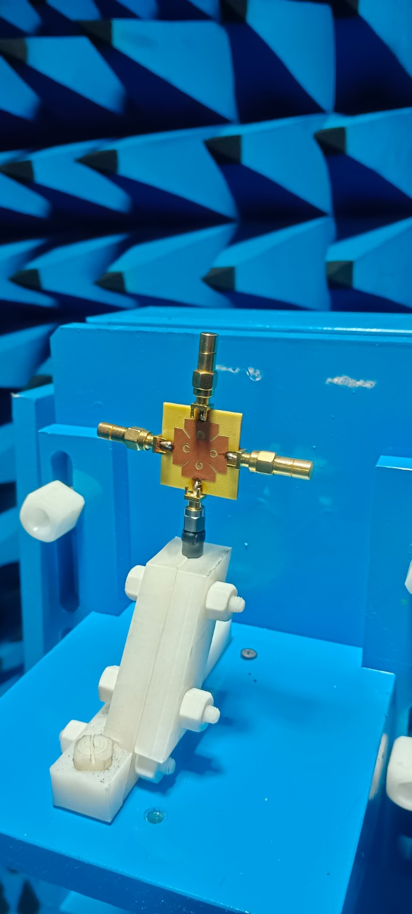

# 📡 CSRR-Loaded Quad-Port Common Patch Antenna for 5G NR

A quad-port common-patch MIMO antenna enhanced with Complementary Split Ring Resonators (CSRRs) for 5G NR applications. This B.Tech ECE major project covers CST design and simulation, prototype fabrication, VNA measurements, and anechoic-chamber validation.

## Highlights

- Quad-port MIMO configuration using a shared radiating patch
- CSRR loading for improved electromagnetic performance
- Simulated and measured validation at the target 3.5 GHz band
- Published on IEEE Xplore

## Key Results

| Parameter | Result |
|---|---:|
| Target frequency | 3.5 GHz |
| Simulated reflection coefficient (S11) | Approximately -35 dB |
| Maximum simulated gain | Approximately 6.59 dBi |
| Maximum surface current | Approximately 179 A/m |

## Tools and Technologies

- CST Microwave Studio
- RF and Microwave Engineering
- Antenna and MIMO Design
- Vector Network Analyzer (VNA)
- Anechoic-chamber measurement
- 5G NR

## Simulation Results

### Reflection Coefficient (S11)

The antenna resonates around 3.5 GHz with a simulated reflection coefficient of approximately -35 dB.

### Antenna Gain

The simulated 3D radiation pattern shows a maximum gain of approximately 6.59 dBi at 3.5 GHz.

### Surface Current Distribution

The current distribution illustrates the concentration across the common patch, feed regions, rectangular slots, and CSRR-loaded structure.

### Radiation Patterns

The plots compare the simulated and measured co-polarization and cross-polarization radiation characteristics.

## Fabricated Prototype and Measurement

| Front view | Back view |
|---|---|
|  |  |

| VNA measurement | Anechoic-chamber measurement |
|---|---|
|  |  |

## IEEE Publication

**Design of a CSRR-Loaded Quad-Port Common Patch Configuration Antenna for 5G NR Applications**

[View the paper on IEEE Xplore](https://ieeexplore.ieee.org/document/11663631)

## Detailed Documentation

See [PROJECT_DETAILS.md](PROJECT_DETAILS.md) for the design methodology, CST workflow, fabrication, measurement setup, and technical analysis.

## Author

**Kasukurthi Vishnu Vardhan**  
B.Tech, Electronics and Communication Engineering  
Vignan's Lara Institute of Technology and Science
